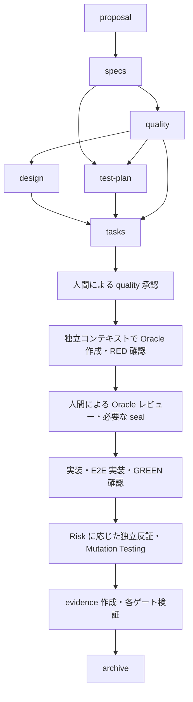

# openspec_custom_testkit 統合実装指示書

作成日: 2026-09-22

このファイルは、新規リポジトリ `openspec_custom_testkit` のルートにコピーし、そのディレクトリで起動した Codex に渡すための指示書である。以前の会話を参照せずに作業を開始できるよう、背景・要件・実装範囲・検証条件を記載する。

## 1. Codex への依頼

以下の２つの既存プロジェクトを調査し、Quality Engineering と E2E テストを一貫した OpenSpec ワークフローとして提供する、新しい bootstrap kit を実装してください。

- 新リポジトリ名: `openspec_custom_testkit`
- 想定 GitHub URL: `https://github.com/sudabon/openspec_custom_testkit`
- QE 元リポジトリ: `https://github.com/sudabon/openspec_quality_kit`
- E2E 元リポジトリ: `https://github.com/sudabon/openspec_e2e_test`

単なるファイルの寄せ集めではなく、スキーマ・インストーラ・品質ポリシー・テスト計画・CI ゲート・証跡の整合性を保つ１つの製品としてまとめること。

調査だけで終わらず、設計、実装、テスト、利用者向けドキュメントまで進める。ただし、後述する本物の承認待ちや仕様の矛盾がある場合は、その内容と必要な判断を具体的に報告すること。承認欄を代筆したり、未実行の検証を成功扱いしたりしない。

### 作業範囲と進め方

- 現在の作業ディレクトリが新リポジトリであることを確認する。旧リポジトリを直接改修しない。
- `AGENTS.md`、既存ファイル、Git の状態を先に確認し、無関係な変更を保持する。
- ソース取得先と採用 commit SHA を記録し、再現可能な状態で調査・移植する。
- 通常の可逆な実装・ローカル検証は進めてよい。公開 API の破壊的変更、品質基準の緩和、重要な仕様の矛盾は事前に説明して確認する。
- GitHub リポジトリは利用者が作成済みという前提。push、公開リリース、旧リポジトリの archive、ブランチ保護設定の変更は別途依頼がない限り行わない。
- 人間向けの説明、OpenSpec の計画文書、README、最終報告は日本語を基本にする。OpenSpec が要求する見出し、ID、キーワード、機械可読キーは維持する。
- 段階ごとに進捗と検証結果を報告する。追加の許可が不要な作業は、そのまま次へ進める。

## 2. 背景と現状

### 調査時点の基準

| 対象 | 確認した commit |
|---|---|
| `openspec_quality_kit` | `e537d10da53112fce684f31d1602c1e061ab87a2` |
| `openspec_e2e_test` | `53e354fa366f02cf412e9ce93419463a37e8255c` |

上記は指示書作成時の基準であり、実装開始時の最新版と一致するとは限らない。差分がある場合は内容を確認し、採用する版を記録すること。

調査時には OpenSpec 1.13.1 で、２つの kit を両方の順序で導入し、両スキーマの validate と change 作成が成功した。QE 側のセルフテストは 34 件成功、失敗・skip は 0 件だった。これは既存 kit の共存確認であり、統合版の動作保証ではない。

### 既存の役割

| 項目 | QE kit | E2E kit |
|---|---|---|
| スキーマ | `quality-driven` | `spec-driven-e2e` |
| 主な成果物 | `quality.md` | `test-plan.md` |
| 計画の中心 | Risk / Failure Mode / Oracle / Test Layer | 全仕様シナリオの E2E 対応・対象外判断 |
| 実装支援 | 独立 Oracle 作成、反証レビュー | Playwright 規約、fixture、タグ |
| ゲート | 承認、seal、証跡、high の Mutation Testing | test-plan とタグ付きテストの存在、E2E 実行 |
| レポート | `evidence.md` | TP-ID ごとの結果と未実装・未実行の検出 |

### 統合で解決する問題

1. １つの change が選ぶスキーマは１つであり、２つの kit を導入しても成果物と依存関係は自動合成されない。
2. QE スキーマには `test-plan`、E2E スキーマには `quality` がない。
3. QE ゲートは既定で `quality-driven` だけを対象にする。新しいスキーマ名を追加しただけでは検査から漏れる。
4. E2E の `check-test-plan.sh` は変更された change のスキーマを区別せず、test-plan とタグ付きテストを要求する。QE 単独や E2E 不要の変更と整合しない。
5. Risk / Oracle と TP-ID の対応、および両ゲートの責務が統合されていない。
6. E2E reusable workflow は npm と `package-lock.json` を前提にする。新 kit の汎用性と、実際に対応する実行環境を明確にする必要がある。

## 3. 製品方針と初期スコープ

### 製品名と初期値

| 項目 | 値 |
|---|---|
| リポジトリ | `openspec_custom_testkit` |
| Node package 名 | `openspec-custom-testkit` |
| CLI 名 | `openspec-custom-testkit` |
| 新規導入時の標準スキーマ | `quality-driven-e2e` |
| 新しい管理情報ファイル | `.openspec-custom-testkit.json` |

リポジトリ名は確定。その他は本指示書の初期設計値として使用し、変更が必要なら理由と影響を記録する。npm registry への公開は初期スコープに含めず、GitHub からの `npx` 導入を成立させる。

想定する利用者向けコマンド:

```bash
npx github:sudabon/openspec_custom_testkit --language Japanese
npx github:sudabon/openspec_custom_testkit install --target /path/to/project
npx github:sudabon/openspec_custom_testkit update
npx github:sudabon/openspec_custom_testkit --dry-run
```

公開前の検証はローカル CLI と `npm pack` の成果物を使う。上記の GitHub 導入が未検証なら、その旨を明記する。

### 必須の提供範囲

- 統合スキーマと全テンプレート。
- 単一の冪等な install / update コマンド。
- AI Quality Policy、Oracle 作成・反証の役割定義。
- Playwright 実装規約、fixture ガイド、TP-ID レポータ。
- 共通の対象 change 判定と、QE / E2E の決定的ゲート。
- reusable workflow または利用者が組み込める CI の明確なインターフェース。
- 旧 kit 導入済みプロジェクトへの安全な移行手順。
- 回帰テスト、統合テスト、日本語ドキュメント。

### 初期スコープに含めないもの

- 品質ダッシュボード、SaaS、専用サーバー。
- すべての言語・テストフレームワーク用の自動環境構築。
- OpenSpec 本体の fork、生成済み `opsx` コマンドへの直接パッチ。
- 古い change の一括変換、旧リポジトリの廃止。
- 実装 Agent による人間承認・seal の自動化。
- 全変更への E2E 強制や、テスト本数・Coverage の高さだけによる品質判定。
- OpenSpec の外部 store への自動配置。初期版は repo-local を必須対応とし、store 設定を検出した場合の制約を明示する。対応していない配置先で成功扱いしない。

## 4. 統合ワークフロー

E2E は品質保証を構成するテスト層の１つとして扱う。受け入れ基準の原本は specs、検証方針の原本は quality、E2E への具体化は test-plan とする。



これは依存関係を示す。`test-plan` は実装設計から期待値を逆算せず、specs と quality を基に作成する。design と test-plan は依存が満たされれば独立して作成できる。

### 計画アーティファクト

| ID | 出力 | 必須依存 |
|---|---|---|
| `proposal` | `proposal.md` | なし |
| `specs` | `specs/**/*.md` | `proposal` |
| `quality` | `quality.md` | `specs` |
| `design` | `design.md` | `proposal`, `quality` |
| `test-plan` | `test-plan.md` | `specs`, `quality` |
| `tasks` | `tasks.md` | `specs`, `quality`, `design`, `test-plan` |

- `apply` は tasks 作成後に開始可能とし、必要な計画ファイルが instructions のコンテキストに届くことを実機で確認する。
- `evidence.md` は実行後の成果物。apply 開始前の必須依存にして循環を作らない。
- `skip_specs: true` の純粋な文書変更・内部整理でも不自然な架空仕様を作らせない。OpenSpec の実際の skip 動作と、quality / test-plan の入力・対象外表現を検証する。
- schema validate の成功だけでなく、実際の change の status、instructions、apply の状態遷移で検証する。

## 5. アーティファクトの責務と追跡可能性

### quality.md

既存の以下の要素を継承する。

- Risk Register: `R1` など。全 Risk の最大値を `risk_level` とする。
- Failure Modes: `F1` など。境界値、異常入力、例外、再試行、冪等性、並行性、状態遷移、認可、後方互換を検討する。
- Test Oracles: `O1` など。観測点と具体的な期待値・不変条件を明記する。
- Test Layer Mapping: Static / Unit / Integration / E2E / Monitoring と選定理由。
- Quality Gates、Independent Verification、Residual Risk。
- `approved_by`、`approved_at`、`oracle_paths`、`oracle_digest` の既存の意味。

HTTP ステータスだけ、存在確認だけ、例外が発生しないだけのテストを、状態変化や副作用を検証すべき Oracle の代わりに使わない。

### test-plan.md

- specs の全シナリオを列挙し、E2E 対象か、別層へ委譲するかを明示する。
- 対象の観点に `TP-001` からの ID を付ける。
- 対応 Requirement / Scenario、Risk / Oracle、fixture、操作意図、期待結果を記録する。
- 新しい受け入れ基準を作らず、quality とリスク評価・対象層が矛盾しないようにする。
- テストには `@<change-id>` と `@TP-NNN` を付ける。
- E2E 不要の場合も計画成果物を作り、対象外理由と代替検証を記録する。空の test-plan やテストを置くだけの回避は禁止する。
- CI が読める明示的な E2E 適用状態を定義する。例えば `e2e: required | not-applicable`。正式なキーと判定規則は設計で固定し、テンプレート・実装・ドキュメント・テストを一致させる。
- 適用状態の原本は１か所にする。quality の層選択との矛盾は検出し、記述が不明なら勝手に対象外にしない。

追跡例:

```text
Scenario: 二重送信を防ぐ
  → R1: 外部への重複送信
  → F1: 連続クリックで２回の送信
  → O1: 外部送信回数が１回
  → TP-001: 送信操作を連続で実施
  → @add-delivery @TP-001 の Playwright テスト
  → evidence.md の結果・実行日時・コマンド
```

すべての Oracle を E2E にする必要はない。Unit / Integration の Oracle は TP-ID がなくても、Risk から証跡まで追跡できればよい。

### tasks.md

次の順序と責務を保持し、各チェックボックスに完了条件を書く。

1. Oracle テスト作成、意味のある RED の確認、人間による必要な seal。
2. 実装とテスト基盤・fixture の整備。
3. test-plan の各 TP-ID に対応する E2E 実装・検証。
4. Risk に応じた独立反証、反例への対応、必要な Mutation Testing。
5. evidence 作成、ゲート実行、残留リスクの確認。

Oracle 自体が E2E である場合、そのテストは Oracle 段階で作る。同じ観点を後段で重複実装させない。実行可能な RED を得るために必要な最小限の harness 準備は先行させてよいが、製品実装を先に完成させて期待値を逆算しない。

既存の QE ゲートは「番号２以降のタスク完了」を実装進行の目安にする。タスク構造を変える場合、ゲートとセットで見直し、seal 前の実装完了を検出できることを検証する。タスク記録から実際の編集時刻まで証明できるとは主張しない。

### evidence.md

- 全 Risk ID に、対応する Failure Mode / Oracle / テスト層 / TP-ID（該当時）/ 結果を記載する。
- 実行コマンド、実行日時、対象 revision、結果の取得元を記録する。
- 反証で検討した観点、発見した反例、その修正または承認済み Residual を記載する。
- E2E 対象外の場合は理由と代替検証結果を記録する。
- high の Mutation Testing は実行結果と適用閾値を記録する。
- seal 後の Oracle 修正は変更理由と人間による再承認・再 seal を追跡する。
- ID の単なる文字列出現だけで十分な証跡と判定しない。必要な項目の欠落を検出し、文書の構造チェックとテスト実行結果の検証を区別する。

## 6. 品質ポリシーと独立検証

### Risk ごとの既存基準

| Gate | low | medium | high |
|---|---|---|---|
| quality の人間承認 | 必須 | 必須 | 必須 |
| Oracle の seal | 任意 | 必須 | 必須 |
| Static / 型 / Lint | 適用するチェック必須 | 適用するチェック必須 | 適用するチェック必須 |
| Oracle テスト | 必須 | 必須 | 必須 |
| Falsification | 任意 | 必須 | 必須 |
| Mutation Testing | 不要 | 任意 | 必須、既存の初期閾値は 70% |
| Human Code Review | 任意 | 必須 | 必須、ドメイン担当を含む |
| Coverage | 参考指標 | 参考指標 | 参考指標 |
| E2E | 仕様・層選択に応じる | 仕様・層選択に応じる | 仕様・層選択に応じる |

既存 QE の policy は low の反証を任意とする一方、schema instruction には一律の反証要求がある。このような既存内部の不一致は、移植時に隠さず、差分と提案を示して確認する。省略を簡単にする目的で承認や品質基準を弱めない。

### 独立コンテキスト

- Oracle writer は specs、quality、policy、および呼び出しに必要な公開インターフェースを入力にする。
- 実装コード、design、実装 Agent の推論・会話を Oracle の期待値決定に持ち込まない。
- TP-ID の転記が必要なら、根拠を変更しない ID 対応情報として扱う。追加の意味的入力が必要になる場合は独立性の設計を見直す。
- Falsifier は specs、quality、実装差分を入力に反例を探し、実装コードや seal 済み Oracle を直接修正しない。
- 実行基盤が別コンテキストの起動を提供しない場合、独立したセッションへの引き継ぎ手順を用意する。同じ会話で役割を宣言し直しただけで独立検証済みにしない。
- Claude 用の役割定義を継承する。Codex で実行する場合も独立セッションまたは利用可能な委譲機構で実施できるよう、製品に依存しない入力・禁止事項・成果物の定義を用意する。
- Codex 固有の設定ファイルや API を追加する場合は、実装時点の公式仕様を確認する。Claude の `.claude/agents` が Codex に自動認識されるとは記載しない。

### 人間の承認と kit 開発の区別

- 利用者プロジェクトの `approved_by` / `approved_at` を Agent が記入しない。seal も人間が実行する。
- 自動テスト内の隔離 fixture では、ダミーの承認情報・seal を使ってゲートを検証してよい。実際の承認と混同しない。
- `payload/` の品質ポリシーやゲートは、今回作成を依頼された製品ソースであり、統合のために編集する対象である。
- 導入先で保護対象とする品質基盤を、実装 Agent が自分のテストを通すために書き換えることとは区別する。
- 承認欄とダイジェストは本人性や改ざん耐性の完全な証明ではない。CODEOWNERS とブランチ保護の役割・限界を説明する。

## 7. インストーラと互換性

### CLI と更新

- 既存の `install` / `update` / `--target` / `--dry-run` / `--force` / `--language` / `--e2e-root` の使用感を維持する。
- Node 標準ライブラリ中心の既存実装を活用する。依存追加は実際の必要性を説明し、不要な全面書き換えはしない。
- 同一内容は skip、利用者が変更したファイルは差分を表示して保持する。
- `--force` の対象と例外を明示する。既存の `openspec/quality-policy.md` は `--force` でも上書きしない。
- dry-run はファイル・管理情報・権限を変更しない。
- 言語、context、rules、他ツールのマーカーブロックを保持する。
- update で E2E の配置先が意図せず移動しないよう、管理情報を引き継ぐ。
- 管理情報に kit の版と採用 E2E root を記録し、旧 stamp の扱いを文書化する。
- 指定した target 外に誤って書き込むパスや危険な相対パスは拒否する。

### スキーマ選択

- 新規導入、または既定の `spec-driven` からの導入では `quality-driven-e2e` を標準にする。
- `quality-driven` / `spec-driven-e2e` / その他のカスタムスキーマを既に使うプロジェクトでは、無断で既定を切り替えず、明示的な移行方法を案内する。
- 進行中 change の `.openspec.yaml` は書き換えない。
- 旧スキーマは互換用に保持・提供し、旧 change を旧形式のまま完了できるようにする。すべてを同名 alias で統合スキーマに差し替えない。
- 旧スキーマの動作を固定する互換テストを用意し、新機能は原則として統合スキーマへ追加する。

### 移行時の既存ファイル

- 同じパスを持つ `scripts/qe-gate.sh`、`scripts/check-test-plan.sh`、`scripts/e2e-report.mjs` は衝突判定の対象になる。
- 旧 kit の既知の未編集ファイルと、利用者の独自編集を区別できる移行方式を設計する。判別不能なら保持して差分を示す。
- 必要な新ゲートへ更新されなかった状態を「統合完了」と報告しない。未移行ファイルと次の操作を一覧にする。
- 既存の旧 CLI 引数・終了コードを維持する。新機能に破壊的変更が必要なら別インターフェースに分けるか確認を求める。
- 既存の E2E root、Playwright config、context マーカー、言語を引き継ぐ。
- 実際の Playwright config がある場合は上書きせず、設定例と必要差分を提供する。
- `openspec init` 前後の導入を両方サポートする。既存 config がある状態での `openspec init --language` の制約も案内する。
- OpenSpec が生成するコマンド・スキルを編集せず、`openspec update` 後も独自配布物が保持される構成にする。

旧 GitHub URL や旧 reusable workflow は、この新リポジトリだけでは置き換えられない。既存２リポジトリを残す前提で、利用者が新 URL へ明示的に移行する手順を書く。

## 8. ゲートと CI

### 共通の対象判定

- スキーマ、active / archived、E2E 適用状態、変更差分から対象を決めるロジックを共通化する。
- `quality-driven-e2e` は QE と、適用される E2E の両方を検査する。
- 旧 `quality-driven` は QE、旧 `spec-driven-e2e` は E2E として扱う。旧 change に新しい成果物を遡及的に要求しない。
- 無関係なスキーマは対象外理由を表示する。統合 change のメタデータ破損・判定不能を黙って skip しない。
- 複数 change、QE と E2E の混在、archive 移動、削除、change 差分なしを扱う。
- 仕様ファイルに差分がない実装修正 PR でも、既存テストや smoke が適切に走る設計にする。change 検出だけで製品の回帰テストを代替しない。
- unknown / missing の状態と、確認済みの対象外を区別する。

### QE ゲート

- tasks があるのに quality がない場合は失敗。
- 未承認でタスクを完了扱いにした場合は失敗。
- medium / high で、必要な seal 前に実装タスクを完了扱いにした場合は失敗。
- seal 済み Oracle の内容変更、追加、削除、リネームを検出する。空の Oracle 集合を有効な seal として扱わない。
- archive の最終検査でも、必要な承認・seal・Risk の妥当性・未完了タスク・証跡を確認し、移動で検査を回避できないようにする。
- high で Mutation Testing コマンドや必要な結果がない場合、成功扱いしない。閾値未達は非ゼロ終了する契約とする。
- 既存 `QE_SCHEMA` 等のインターフェースを保持する場合、その優先順位と統合版の既定対象を定義する。

### E2E ゲートとレポータ

- `required` なら test-plan、TP-ID に対応するテスト、対象実行結果を検査する。
- テストファイル内のタグ文字列の存在と、実際に実行されたテストの coverage を区別する。
- 同じ TP-ID が他の change に存在しても、その結果で現在の change の不足を埋めない。change と TP-ID の組で識別する。
- `not-applicable` なら理由と代替検証を確認し、当該 change の E2E 実行を不要とする。他の change や smoke まで無効化しない。
- `required` なのにテストが０件、未実行、skip のみ、レポート欠落の場合は不足として扱う。
- リトライ後成功・flaky・失敗・skip の扱いを明文化する。既存の出力・終了コードを確認して互換性を保つ。
- 既存レポータの終了コード `0: 成功 / 1: coverage 欠落 / 2: 入力・鮮度エラー / 3: テスト失敗` を維持する。
- 既存 `--max-age` と実行時刻表示を維持する。CI では実行ごとの出力分離なども使い、前回の JSON を今回の成功として受け入れない。
- CI での `|| true` により失敗を握りつぶさない。表示目的で結果を保存しても、最終 job に元の失敗を反映する。
- change-id の抽出・タグ照合で prefix の取り違えや正規表現の誤解釈が起きないようにする。

### CI の実行契約

- OpenSpec の版、working-directory、比較元 ref、テスト実行、Mutation Testing、E2E base URL の指定方法を文書化する。
- working-directory が frontend 等でも change の検出は repo root を基準にする。
- npm 専用の例を全プロジェクトで動く汎用 workflow として説明しない。npm / pnpm / yarn 等は、明示的な選択または利用者が構成する setup 手順で扱い、対応範囲を限定する。
- テストコマンドを受け取るだけで依存が導入済みになるとは想定しない。必要な runtime、依存、browser、DB、アプリ起動の責任を明記する。
- Playwright の `webServer` を使う例、既存サーバーを使う場合の前提、monorepo の例を示す。
- 任意コマンド入力は信頼された workflow 設定から渡す前提とし、PR タイトル等をシェルコードとして直接展開しない。
- 未対応の構成は明確な診断を返す。内部エラーや対象０件を成功と取り違えない。
- 既存の２つの reusable workflow から、どの参照先と inputs を変えるか移行例を書く。

## 9. 推奨ディレクトリ構成

以下は出発点。責務が明確なら内部の分割は調整してよい。

```text
openspec_custom_testkit/
├── README.md
├── LICENSE
├── package.json
├── install.mjs
├── docs/
│   ├── architecture.md
│   ├── migration.md
│   ├── workflow.md
│   ├── compatibility.md
│   └── upstream-sources.md
├── payload/
│   ├── openspec/
│   │   ├── quality-policy.md
│   │   └── schemas/
│   │       ├── quality-driven-e2e/
│   │       │   ├── schema.yaml
│   │       │   └── templates/
│   │       │       ├── proposal.md
│   │       │       ├── spec.md
│   │       │       ├── quality.md
│   │       │       ├── design.md
│   │       │       ├── test-plan.md
│   │       │       ├── tasks.md
│   │       │       └── evidence.md
│   │       ├── quality-driven/
│   │       └── spec-driven-e2e/
│   ├── scripts/
│   │   ├── qe-gate.sh
│   │   ├── check-test-plan.sh
│   │   └── e2e-report.mjs
│   ├── .claude/
│   │   ├── agents/
│   │   └── skills/e2e-conventions/
│   ├── playwright.config.example.ts
│   └── tests/e2e/fixtures/README.md
├── test/
│   ├── fixtures/
│   └── selftest.sh
└── .github/workflows/
```

共通判定モジュールや製品に依存しない役割定義は適切な場所へ追加する。`payload/.claude/` 等をルートの `.gitignore` で誤って除外しない。

Node / OpenSpec の対応版は移植元と実装時点の動作確認に基づいて固定する。調査時の QE kit の要件は Node.js 20 以上、OpenSpec 1.13.1 以上。最低対応版・CI の検証版・README の記載を一致させる。

## 10. 実装段階

### 段階 1: 調査と計画

1. 新リポジトリの状態とローカル指示を確認する。
2. 両元リポジトリの README、install、payload、workflow、selftest、license を読む。
3. 採用 SHA と移植対象、既存の内部矛盾、互換性の境界を整理する。
4. 本指示書に沿う OpenSpec change を作成する。日本語で proposal / specs / design / tasks、および必要な検証計画を作成する。
5. 統合スキーマがまだない bootstrap 段階は、利用可能な既存スキーマで計画し、同じ名前の製品 payload と開発用 config を混同しない。
6. 未確定事項が公開 API・品質基準を変える場合は、選択肢と推奨をまとめて確認する。それ以外の内部実装は既存方式を優先して進める。

### 段階 2: スキーマとテンプレート

1. 統合スキーマ、各テンプレート、policy と役割定義を実装する。
2. 依存 DAG、E2E 対象外表現、ID 対応、Oracle の独立性を揃える。
3. 一時プロジェクトで status / instructions / apply のコンテキストを検証する。

### 段階 3: インストーラと移行

1. 両インストーラの共通処理を整理し、１つの CLI にする。
2. E2E root 探索、context merge、既存ファイル保持、旧 stamp の引き継ぎを実装する。
3. 新規、各旧 kit 単独導入済み、両方導入済み、独自編集済みを検証する。

### 段階 4: ゲートと CI

1. 共通対象判定、QE / E2E の各検査、レポータを統合する。
2. 適用なし・未実行・検証失敗を区別する。
3. CI の入力・環境準備・結果の伝達を整備する。

### 段階 5: 検証とドキュメント

1. 既存テストを移植し、統合境界の回帰テストを追加する。
2. 最小の実行用アプリまたは fixture で、実際の Playwright 実行から証跡までの動作を確認する。
3. README、移行ガイド、互換性、開発手順、CI 例を仕上げる。
4. lint、テスト、pack 内容、Git 差分を確認し、未検証事項を含めて報告する。

## 11. 必須検証マトリクス

テストは実装の写しではなく、利用者から見た挙動と検査漏れを検証する。実行時間の重い項目はまとめて検証し、未実行を成功に数えない。

| 分類 | 必須ケース |
|---|---|
| 導入 | init 前、init 後、別 target、再 install、update、dry-run |
| 保持 | language / context / rules、他ツールのマーカー、policy、利用者編集 |
| 移行 | QE のみ、E2E のみ、両方、旧 stamp、旧スキーマの進行中 change |
| 配置 | 既存 Playwright 設定、複数設定、monorepo、明示 E2E root、root 変更 |
| OpenSpec | schema validate、実際の依存関係、instructions の入力、apply readiness、skip_specs |
| 判定 | 統合・各旧スキーマ・無関係なスキーマ、混在 PR、対象なし、メタデータ破損 |
| QE | 未承認、seal 前実装、seal 後の変更・追加・削除・リネーム、空 Oracle、高 Risk |
| E2E | required / not-applicable、理由欠落、層選択との矛盾、タグ不足、TP-ID 不足、他 change の同一 TP-ID |
| 実行結果 | 成功、失敗、skip、０件、flaky、JSON 欠落、古い JSON、時刻なし、終了コード |
| Archive | 未完了 tasks、quality 欠落、不正 Risk、承認・seal 不足、証跡欠落、Risk の未対応 |
| CI | base-ref、working-directory、依存・サーバー準備、失敗伝達、Mutation コマンド未指定 |
| 配布 | npm pack に必要な payload が入る、不要な調査 checkout を含まない、shell 実行権限 |
| 更新耐性 | openspec update 後も独自 schema・roles・scripts が残る |

最低限、macOS と Linux で動かす予定の処理は両環境の差を考慮する。GNU 固有コマンドを使う場合は依存を明示するか移植可能な実装にする。

統合 smoke は、少なくとも「承認済み fixture の Oracle → 実装済み fixture の E2E → レポータ → evidence 検査」と、「E2E 不要の change の代替検証」を確認する。fixture 上の擬似承認であることを明記する。

## 12. 必須ドキュメント

- `README.md`: 目的、対応環境、導入、更新、標準フロー、短い利用例。
- `docs/architecture.md`: 成果物の依存関係、共通判定、各ゲートの責務、独立コンテキスト。
- `docs/workflow.md`: 人間と Agent の作業分担、承認、seal、反証、E2E、証跡、archive。
- `docs/migration.md`: 各旧 kit・両方導入済みからの移行、旧 change 継続、独自編集の扱い、戻し方。
- `docs/compatibility.md`: CLI、旧 schema、終了コード、対応 runtime、repo-local の範囲、既知の制約。
- `docs/upstream-sources.md`: 元 URL、採用 SHA、OpenSpec fork 元、ライセンス・著作権表示、今後の追従方法。
- CI の例: npm の単純な構成、monorepo、E2E 不要 change、high Risk の Mutation Testing。

既存の MIT ライセンスと必要な著作権表示を確認し、移植元の出典を残す。コピーしたコードを完全な新規作成と記載しない。

## 13. 完了条件と報告

以下を満たして初期版の完了とする。

- 統合 kit を隔離された対象プロジェクトへ導入できる。
- 新規 change で quality と test-plan の両方が必須の計画フローとして機能する。
- E2E 不要の変更が理由・代替検証付きで扱え、必要な E2E の省略を検出できる。
- 旧 change と既存設定を壊さず移行でき、未移行の重要ファイルを成功扱いしない。
- Risk から Oracle、テスト、証跡へ追跡できる。
- 独立検証と人間承認の境界が文書・instruction・ゲートで矛盾しない。
- 必須 lint とテストが成功し、該当する検証マトリクスを満たす。
- CI・配布・実環境で未検証の項目が明示されている。ローカル検証だけで GitHub Actions 成功や公開済みを主張しない。
- OpenSpec tasks の完了状態が実際の検証結果に一致する。
- 実装・利用・移行のドキュメントが揃う。

最終報告には、変更概要、互換性への影響、実行した検証と結果、未実行項目、残るリスク、人間の作業が必要な項目を記載する。手順や品質基準を都合よく弱めて完了扱いにしない。

## 14. この指示書の使い方

新リポジトリにこのファイルをコピーし、Codex に以下を依頼する。

```text
OPENSPEC_CUSTOM_TESTKIT_IMPLEMENTATION_BRIEF.md を読み、
openspec_custom_testkit を実装してください。

まず AGENTS.md、現在の Git 状態、移植元２リポジトリを確認し、
指示書に沿った OpenSpec の計画を日本語で作成してください。
その後、承認が必要な事項を除いて実装・テスト・ドキュメント作成まで進めてください。
既存の変更を保持し、公開 API や品質基準の変更が必要な場合は事前に説明してください。
push・公開リリース・旧リポジトリの変更は行わず、結果と残るリスクを報告してください。
```

人間による実際の quality 承認や seal が必要になったら、レビュー対象ファイルと必要な操作を提示して停止する。利用者がその操作を終えた後、残りの工程を再開する。
